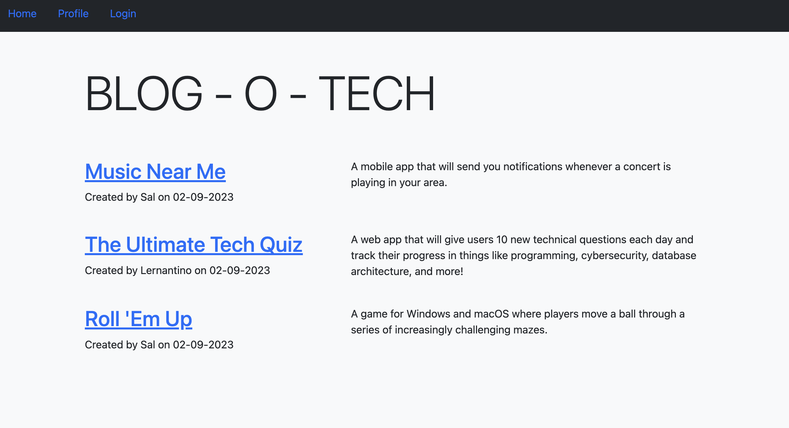

# blog-o-tech
CMS style Tech blog
# About
This app is a tech blog based in the CMS style. It gives a user the ability to share and comment on their favorite apps and technology.

# Installation
To use this application the user must install the following:

Package.json 

dontenv 

MySQL2 
    Sequelize

Express
    Express handlebars

bcrypt

# Description
This app is for anyone that wants to read, comment or publish a post related to technology. A user can sign up and view blog posts from other users. They can come back and simply log in to view their profile, the post they have made as well as comment on other blog posts. 

# Mock-up
The following image shows the applications functionality and appearance.

# Links

## Github Repo
https://github.com/KyleKarotko/blog-o-tech
## Deployed (heroku) application link
https://blog-o-tech.herokuapp.com/